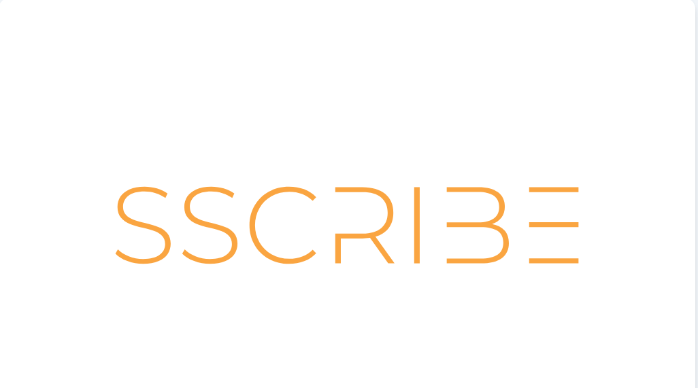

# 📝 Scribe - Privacy-First Note-Taking App

A modern, offline-first desktop note-taking application built with Electron, React, and TypeScript. Scribe prioritizes privacy by storing all data locally on your computer.



## ✨ Features

### 🎯 **Core Functionality**
- **Offline-First**: All data stored locally on your computer
- **Rich Text Editing**: Full formatting capabilities with auto-save
- **Dark Mode**: Beautiful dark and light themes
- **System Tray**: Minimize to system tray, quick access
- **Keyboard Shortcuts**: Power user features (Ctrl+S to save)

### 🗂️ **Organization**
- **Smart Sidebar**: Advanced navigation with folders and tags
- **Search & Filter**: Real-time search with multiple filter options
- **Note Management**: Pin, delete, organize notes efficiently
- **Auto-save**: Never lose your work with automatic persistence

### 🔒 **Privacy & Security**
- **Local Storage**: All notes stored on your device
- **No Cloud**: Zero data transmission to external servers
- **Encryption Ready**: Built-in encryption support for sensitive notes
- **Cross-Platform**: Works on Windows, macOS, and Linux

## 🚀 Getting Started

### Prerequisites
- Node.js 18+ 
- npm or yarn

### Installation

1. **Clone the repository**
   ```bash
   git clone https://github.com/khorne182/Scribe.git
   cd Scribe
   ```

2. **Install dependencies**
   ```bash
   npm install
   ```

3. **Start development server**
   ```bash
   npm run dev
   ```

4. **Build for production**
   ```bash
   npm run build
   ```

## 🛠️ Development

### Project Structure
```
scribe/
├── src/
│   ├── main/           # Electron main process
│   ├── preload/        # Security bridge
│   └── renderer/       # React frontend
│       ├── components/ # UI components
│       └── lib/        # Database & utilities
├── images/             # App icons and assets
└── build/              # Build configuration
```

### Tech Stack
- **Frontend**: React 19, TypeScript, Tailwind CSS
- **Backend**: Electron, Node.js
- **Database**: SQLite (Phase 5), localStorage (current)
- **Styling**: Tailwind CSS with Fluent Design System
- **Icons**: Lucide React

## 📋 Development Phases

### ✅ **Completed Phases**
- **Phase 1**: Project Setup & Core Infrastructure
- **Phase 2**: Database & Data Layer (localStorage)
- **Phase 3**: Core UI Layout & Navigation
- **Phase 4**: Note Editor Implementation

### 🔄 **In Progress**
- **Phase 5**: File System Integration
  - Local file storage in `Documents/Scribe/`
  - Format selection (md/txt/pdf)
  - File organization system

### 📅 **Upcoming Phases**
- **Phase 6**: Import/Export & Backup
- **Phase 7**: System Integration & Advanced Features
- **Phase 8**: Polish, Testing & Production Build

## 🎨 UI Features

### Enhanced Sidebar
- **Quick Filters**: All Notes, Pinned Notes, Recent Notes
- **Folder Management**: Expandable folders with color coding
- **Tag System**: Visual tag display with color indicators
- **Advanced Search**: Real-time search with filtering

### Rich Text Editor
- **Formatting**: Bold, italic, underline, strikethrough
- **Lists**: Bulleted and numbered lists with indentation
- **Headers**: H1-H6 support
- **Links & Images**: Easy insertion and editing
- **Colors**: Text and background color options
- **Auto-save**: Automatic saving with visual indicators

## 🔧 Configuration

### Environment Variables
```bash
# Development
NODE_ENV=development

# Production
NODE_ENV=production
```

### Build Configuration
- **Electron Builder**: Cross-platform builds
- **Vite**: Fast development and building
- **TypeScript**: Full type safety
- **ESLint**: Code quality and consistency

## 📱 Screenshots

*Screenshots will be added in future updates*

## 🤝 Contributing

1. Fork the repository
2. Create a feature branch (`git checkout -b feature/amazing-feature`)
3. Commit your changes (`git commit -m 'Add amazing feature'`)
4. Push to the branch (`git push origin feature/amazing-feature`)
5. Open a Pull Request

## 📄 License

This project is licensed under the MIT License - see the [LICENSE](LICENSE) file for details.

## 🙏 Acknowledgments

- **Electron** - Cross-platform desktop apps
- **React** - User interface library
- **Tailwind CSS** - Utility-first CSS framework
- **Lucide** - Beautiful icon library
- **Fluent Design System** - Microsoft's design language

## 📞 Support

- **Issues**: [GitHub Issues](https://github.com/khorne182/Scribe/issues)
- **Discussions**: [GitHub Discussions](https://github.com/khorne182/Scribe/discussions)

## 🏷️ Tags

`electron` `react` `typescript` `note-taking` `privacy` `offline` `desktop-app` `tailwind` `markdown`

---

**Made with ❤️ for privacy-conscious note-takers**